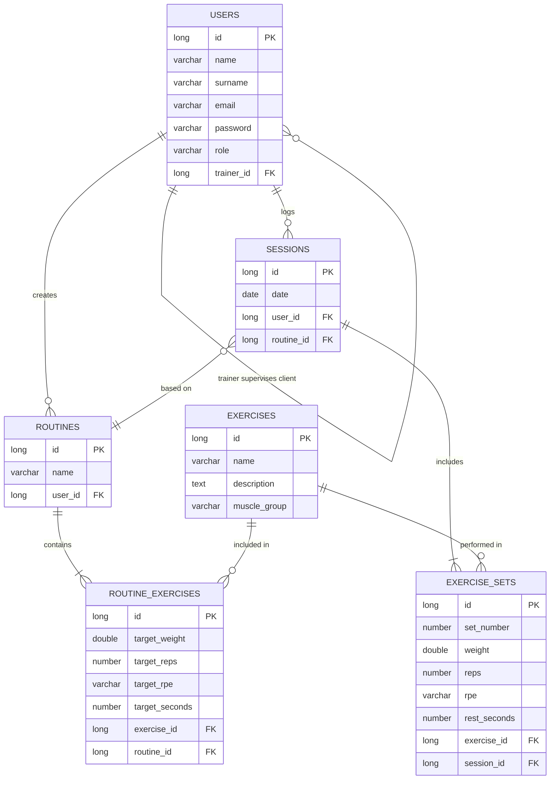

# 🏋️‍♂️ Training API (Powerbuilding & Coaching)


A robust REST API for fitness coaching management.

Built by merging backend technical discipline with real-world sports physiotherapy and high-level powerbuilding expertise, this project models the true complexities of strength programming. It prioritizes **Domain-Driven Design (DDD)** concepts, ensuring business logic centralization and shielding against the anemic domain model anti-pattern.

## 🛠️ Tech Stack

* **Core:** Java 21 + Spring Boot 3.4
* **Security:** Spring Security + JWT authentication
* **Persistence:** Spring Data JPA + PostgreSQL + Flyway (Migrations)
* **Validations:** Jakarta Validation (Zero-Trust Models)
* **Testing:** JUnit 5 + Mockito
* **DevOps & Infra:** Docker, Docker Compose, GitHub Actions (CI/CD)
* **API Specs:** Swagger / OpenAPI

## 🧠 Domain Model & Architecture

### Entities
* `User` — Trainers and clients share a single table, differentiated by role (`ROLE_TRAINER` / `ROLE_CLIENT`). A client has a direct reference to their assigned trainer.
* `Exercise` — Shared catalogue available to all users. Features a name, optional description, and muscle group (`Muscles` enum).
* `Routine` — Created by a trainer and linked to a specific client.
* `RoutineExercise` — Links an exercise to a routine with prescribed targets: `targetReps`, `targetWeight`, `targetRpe`, and `targetRestSeconds`.
* `Session` — Logged by a client against a specific routine on a given date (validated as `@PastOrPresent`).
* `ExerciseSet` — Each individual set within a session. Records actual execution: reps, weight, RPE, and rest time.

### 💡 Design decisions worth noting
* **RPE (Rate of Perceived Exertion)** is modelled as an Enum in both `RoutineExercise` and `ExerciseSet`, explicitly distinguishing between the *prescribed target* and the *actual execution* — a distinction that reflects real-world strength programming.
* **Trainer-client relationship** is modelled as a self-referencing `@ManyToOne` on the `User` entity, keeping the schema clean without an extra join table.
* **Exercise catalogue** is shared across all users, consistent with how real fitness platforms and SaaS applications work.

## Database Schema


## 🚦 Project Status (Vertical Slicing)

| Layer / Feature | Status |
| :--- | :---: |
| **Domain models + Jakarta validations** | ✅ Done |
| **Unit tests (model constraint coverage)** | ✅ Done |
| **Database schema design** | ✅ Done |
| Docker + PostgreSQL setup | ⏳ Pending |
| Flyway migrations | ⏳ Pending |
| Repository & Service layers | ⏳ Pending |
| REST controllers & Swagger | ⏳ Pending |
| JWT Authentication (Spring Security) | ⏳ Pending |
| CI/CD (GitHub Actions) | ⏳ Pending |

## 🚀 Getting Started

*Note: Full local setup requires Docker. Instructions will be updated as infrastructure layers are completed.*

1. Clone the repository:
```bash
git clone [https://github.com/jmoreno-dev/training-api.git](https://github.com/jmoreno-dev/training-api.git)
cd training-api
```

## Author

**Jose Antonio Moreno Marín**  
[LinkedIn](https://www.linkedin.com/in/joseantonio-morenomarin) · [josemorenodev.com](https://josemorenodev.com)