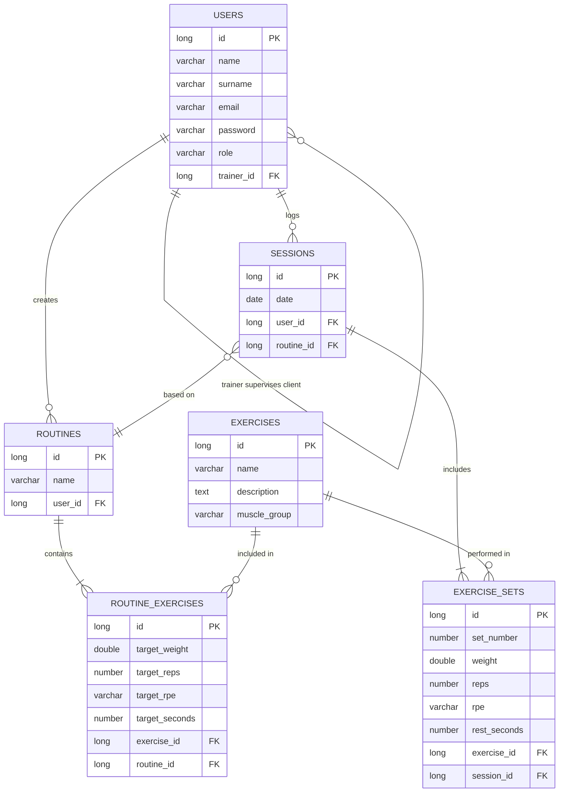

# 🏋️‍♂️ Training API (Powerbuilding & Coaching)


REST API for fitness coaching management, designed with a focus on keeping business rules inside the domain models and avoiding the anemic domain model anti-pattern.

## 🛠️ Tech Stack

* **Core:** Java 21 + Spring Boot 4.0.5
* **Security:** Spring Security + JWT authentication
* **Persistence:** Spring Data JPA + PostgreSQL + Flyway (Migrations)
* **Validations:** Jakarta Validation (Zero-Trust Models)
* **Testing:** JUnit 5 + Mockito
* **DevOps & Infra:** Docker, Docker Compose, GitHub Actions (CI/CD)
* **API Specs:** Swagger / OpenAPI
* **Configuration Management:** Spring Profiles (local, prod) + Environment Variables

## 🧠 Domain Model & Architecture

### Entities
* `User` — Trainers and clients share a single table, differentiated by role (`ROLE_TRAINER` / `ROLE_CLIENT`). A client has a direct reference to their assigned trainer.
* `Exercise` — Shared catalogue available to all users. Features a name, optional description, and muscle group (`Muscles` enum).
* `Routine` — Created by a trainer and linked to a specific client.
* `RoutineExercise` — Links an exercise to a routine with prescribed targets: `targetReps`, `targetWeight`, `targetRpe`, and `targetRestSeconds`.
* `Session` — Logged by a client against a specific routine on a given date (validated as `@PastOrPresent`).
* `ExerciseSet` — Each individual set within a session. Records actual execution: reps, weight, RPE, and rest time.

### 💡 Design decisions worth noting
* **RPE (Rate of Perceived Exertion)** is modelled as an Enum in both `RoutineExercise` and `ExerciseSet`, explicitly distinguishing between the *prescribed target* and the *actual execution* — a distinction that reflects real-world strength programming.
* **Trainer-client relationship** is modelled as a self-referencing `@ManyToOne` on the `User` entity, keeping the schema clean without an extra join table.
* **Exercise catalogue** is shared across all users, consistent with how real fitness platforms and SaaS applications work.

## 🔐 Configuration & Secrets Management

### Environment Variables
The application uses **Spring Profiles** combined with environment variables to manage configuration securely:

```properties
# application.properties (Base configuration)
spring.datasource.url=${DB_URL}
spring.datasource.username=${DB_USERNAME}
spring.datasource.password=${DB_PASSWORD}
```

### Local Development (`.env` file)
A `.env` file in the project root contains local credentials (**excluded from Git** via `.gitignore`):
```dotenv
# .env template (add your own values locally)
DB_NAME=<your_database_name>
DB_USER=<your_database_user>
DB_PASSWORD=<your_database_password>
```

⚠️ **Never commit the `.env` file** — it contains sensitive credentials.

### Spring Profiles
* **Local Profile** (`application-local.properties`): Used during development with hardcoded localhost values and SQL logging enabled.
* **Production Profile** (`application-prod.properties`): Used in production containers, relying on environment variables injected via Docker or Kubernetes.

### Docker Compose Setup
The `docker-compose.yml` orchestrates PostgreSQL locally with environment variables from the `.env` file:
```yaml
services:
  postgres:
    image: postgres:16-alpine
    environment:
      POSTGRES_DB: ${DB_NAME}
      POSTGRES_USER: ${DB_USER}
      POSTGRES_PASSWORD: ${DB_PASSWORD}
    ports:
      - "5432:5432"
    volumes:
      - training_pg_data:/var/lib/postgresql/data
```

## Database Schema


## 🚦 Project Status (Vertical Slicing)

| Layer / Feature                            |  Status   |
|:-------------------------------------------|:---------:|
| **Domain models + Jakarta validations**    |  ✅ Done   |
| **Unit tests (model constraint coverage)** |  ✅ Done   |
| **Database schema design**                 |  ✅ Done   |
| Docker + PostgreSQL setup                  |  ✅ Done   |
| Configuration & Environment Management    |  ✅ Done   |
| Flyway migrations                          | ⏳ Pending |
| Repository & Service layers                | ⏳ Pending |
| REST controllers & Swagger                 | ⏳ Pending |
| JWT Authentication (Spring Security)       | ⏳ Pending |
| CI/CD (GitHub Actions)                     | ⏳ Pending |

## 🚀 Getting Started

### Prerequisites
- Java 21+
- Maven 3.8+
- Docker & Docker Compose

### Local Setup with Docker

1. Clone the repository:
```bash
git clone https://github.com/jmoreno-dev/training-api.git
cd training-api
```

2. Start PostgreSQL container:
```bash
docker-compose up -d
```

3. Run the application with local profile:
```bash
./mvnw spring-boot:run -Dspring-boot.run.arguments="--spring.profiles.active=local"
```

The API will be available at `http://localhost:8080`.

### Environment Variables
The application requires the following environment variables (or a `.env` file):
- `DB_URL` — PostgreSQL JDBC URL
- `DB_USERNAME` — Database user
- `DB_PASSWORD` — Database password

For local development, these are automatically read from `.env`.

## Author

**Jose Antonio Moreno Marín**  
[LinkedIn](https://www.linkedin.com/in/joseantonio-morenomarin) · [josemorenodev.com](https://josemorenodev.com)